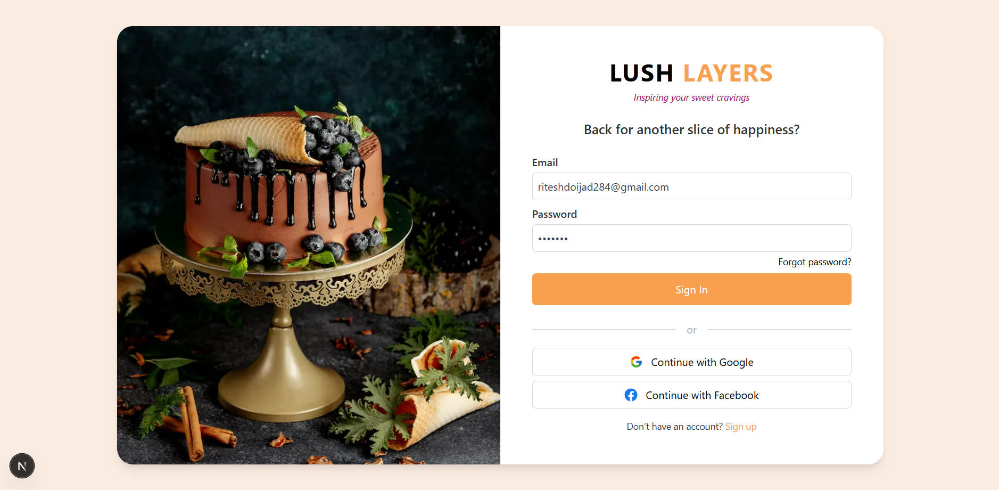
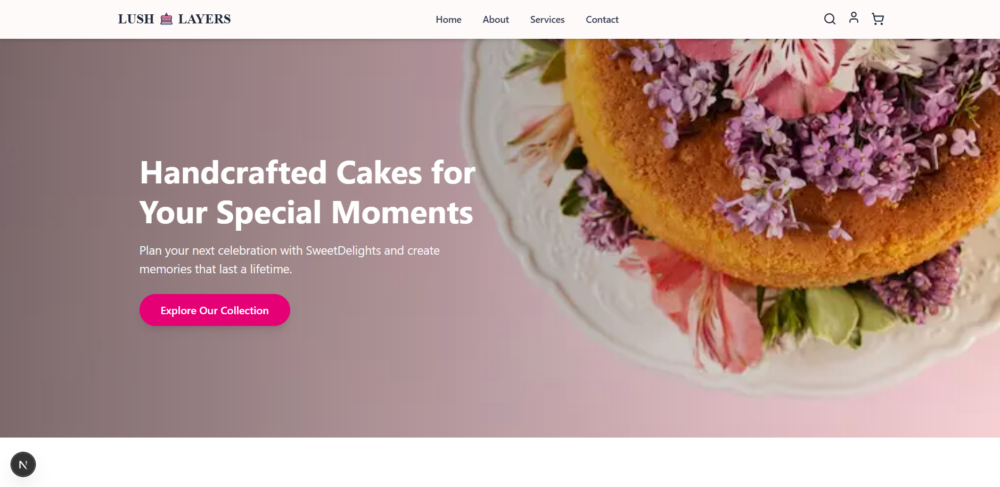
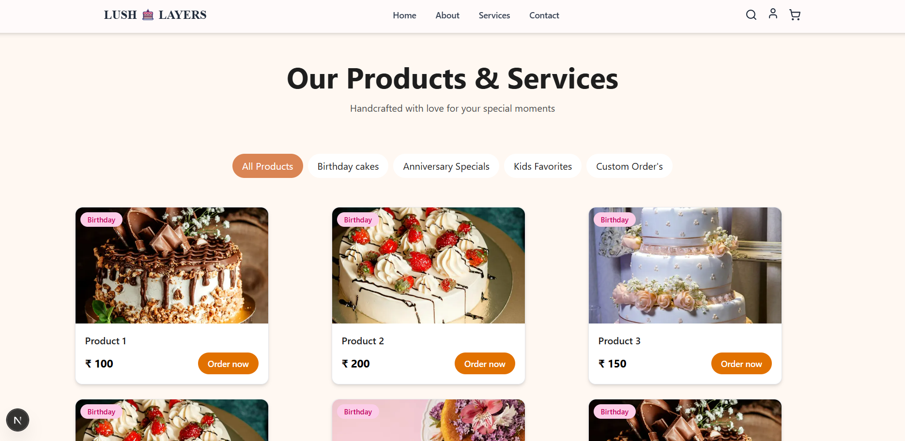

# Project Title

#  Cafe Website with Cart, Booking Support

A visually appealing Cafe Website built using Next.js 14, Tailwind CSS, Redux Toolkit, It features a fully responsive layout with dynamic menu , cart functionality, reservation support, interactive animations, and seamless routing for pages like Menu, Services, Contact, and more.


## Features

###  **Authentication**
- User **Login & Logout** with session persistence
- **Redux Toolkit** for managing authentication state

###  **Cart Functionality**
- **Add to Cart** from any page  
- **Global Cart Panel** accessible site-wide  
- **Order Summary** with item count & total price


###  **Page Navigation**
- **Landing Page:** Hero, About, Offers, Testimonials  
- **Login Page:** login and Sing up page  
- **Services Page:** Image carousel or grid  
- **Contact Page:** Google Map, Form, Address  
- **Our Story & Reviews:** Informational pages


###  **Performance & Accessibility**
- **Mobile-first design** with lazy loading  
- SEO-friendly routing using **Next.js App Router**
- Accessibility best practices (contrast, labels, keyboard nav)

## 🛠️ **Tech Stack**

- **Framework:** Next.js 14 (App Router)
- **Styling:** Tailwind CSS
- **State Management:** Redux Toolkit
- **Routing:** Next.js File-based Routing (App Router)
- **Deployment:** Vercel

## Run Locally

Clone the project

```bash
  git clone https://github.com/ritesh-doijad/cafe-website.git
```

Go to the project directory

```bash
 cd cafe-website     
```

Install dependencies

```bash
  npm install
```

Start the server

```bash
  npm run dev
```


## Screenshots








## Demo

https://cafe-website-liart.vercel.app/login


## 🔗 Links
[](https://riteshdoijad-fmadc9yrs-riteshs-projects-b99d6186.vercel.app/)
[](www.linkedin.com/in/riteshdoijad284)


